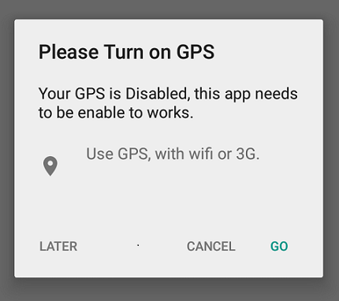

# cordova-dialog-gps
Plugin for **_phonegap/cordova greater or equal than v3.0.0_** to display a dialog and redirect to GPS settings when de GPS is disable.

##Installation

Just type the following statement in your cli Cordova or phonegap .

`phonegap plugin add https://github.com/rodrigo-martinezd/cordova-dialog-gps.git`

or
`cordova plugin add https://github.com/rodrigo-martinezd/cordova-dialog-gps.git`

if you want to install a specific version just add `#v<version>` to the link

Example:

`phonegap plugin add https://github.com/rodrigo-martinezd/cordova-dialog-gps.git#v0.0.1`

##Use

After installation , you can access the object *dialogGPS* embedded in *cordova*
  ```javascript
  document.addEventListener("deviceready",function() {
    /**
    * @param message {string}       message to be displayed.
    * @param description {string}   description of the propertie that you want change.
    * @param callback {function}    callback function to send the index when a button is pressed
    * @param title {string}         title of dialog
    * @param buttons {array}        array with the buttons names with a max three names.
    **/
    cordova.dialogGPS("hello world",function(buttonIndex) {
          //do something with the buttonIndex
      });
  });
  ```
**Remember:** Remember, the object `cordova.dialogGPS` can only be accessed after the `document` is fully charged . This occurs when *deviceready* is called. Therefore it is recommended to make the call to the object within this function .

If `cordova.dialogGPS()` was call without options this will be result to a default message. If you want to customize it,  you can passed options to the constructor.

*Default dialog on android 5.0.2*


##Options

**Message**

First argument, a string with the text to display in the dialog.

**Description**
Second argument, is the text next to the icon of location.

**Callback function**

If you like use callbacks functions. You can pass a callback function as the third argument. This will result after capture a click event in the dialog:

  * 0, if the cancel button or the negative button was pressed.
  * 1, if the neutral button was pressed.
  * 2, if the positive button was pressed.

**Title**

The title of dialog indicated with a string as the fourth argument.

**Buttons's Array**

The **_buttonsLabels array_** as the fifth argument, with the name of the each button to be displayed in the dialog. The names must follow the next order: **Negative button,Neutral button(optional),positive button**.
  
Example: ```["Cancel","Later","Go to Settings"]```

## Some Examples

You can integrate the plugin with geolocation plugin for doing that just wrapped the call to `dialogGPS` in a function and
called from the error callback from geolocation.

code:

```javascript
navigatior.geolocation.getCurrentPosition(function(position){},function(error){
  calldialog();
});

function calldialog() {
  document.addEventListener("deviceready",function(){
    //default dialog
    cordova.dialogGPS();
  });
}
```
Here is an example with all the arguments passed:

```javascript
function calldialog() {
 document.addEventListener("deviceready",function() {
  cordova.dialogGPS("Your GPS is Disabled, this app needs to be enable to works.",//message
                    "Use GPS, with wifi or 3G.",//description
                    function(buttonIndex){//callback
                      switch(buttonIndex) {
                        case 0: break;//cancel
                        case 1: break;//neutro option
                        case 2: break;//user go to configuration
                      }},
                      "Please Turn on GPS",//title
                      ["Cancel","Later","Go"]);//buttons
 });
}
```
The code above result in this dialog:



##License

This plugin was created under the MIT license.

